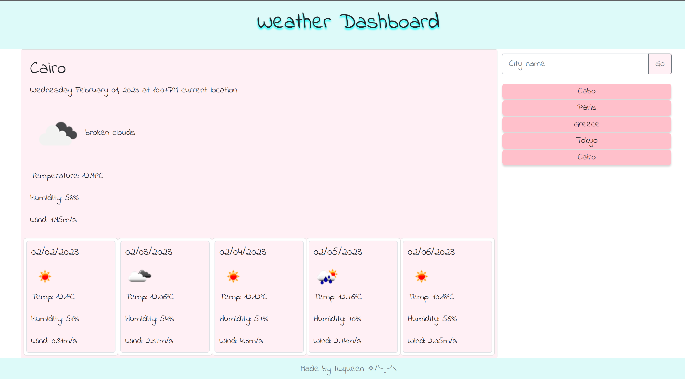

# A simple Weather Dashboard

## Description
The purpose of this website application is to utilize third party API and create a fully functioning webpage. All knowledge is accumulated throughout the first quarter of UCSD's extended studies' coding bootcamp.

The most challenging part of this project is extracting and converting the API array codes into user friendly interface. Many research was done. Getting the date to appear correctly was also a headache. But all is well as there are many others before me who have figured out the solution and shared them online.

## Installation
A browser is needed. Google Chrome preferred.

## Usage
This application will show the current weather and a 5-day forecast for city searched. The city searched will be saved for future reference. If a city does not exist or can not be found by OpenWeather, then an alert will appear.

Deployed application page:
https://twqueen.github.io/M6-Weather/

## Features
* HTML
* CSS/Bootstrap
* JQUERY/JS
* OpenWeather API
* Google Fonts

## Credits
* OpenWeather: https://openweathermap.org/forecast5
* jscottrumptz: https://github.com/jscottrumptz/06-weather-dashboard
* mmeii: https://github.com/mmeii/weather-dashboard
* my brother for helping me debug

## License
MIT License

